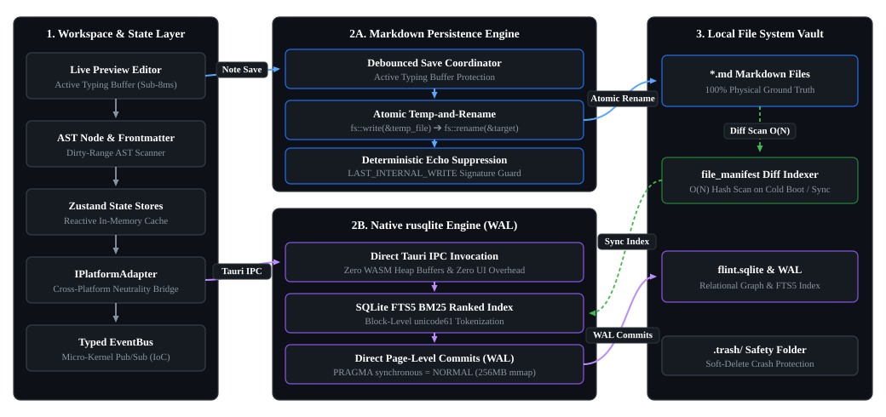

<div align="center">

<pre>
      ___                                   ___                 
     /  /\                    ___          /__/\          ___   
    /  /:/_                  /  /\         \  \:\        /  /\  
   /  /:/ /\  ___     ___   /  /:/          \  \:\      /  /:/  
  /  /:/ /:/ /__/\   /  /\ /__/::\      _____\__\:\    /  /:/   
 /__/:/ /:/  \  \:\ /  /:/ \__\/\:\__  /__/::::::::\  /  /::\   
 \  \:\/:/    \  \:\  /:/     \  \:\/\ \  \:\~~\~~\/ /__/:/\:\  
  \  \::/      \  \:\/:/       \__\::/  \  \:\  ~~~  \__\/  \:\ 
   \  \:\       \  \::/        /__/:/    \  \:\           \  \:\
    \  \:\       \__\/         \__\/      \  \:\           \__\/
     \__\/                                 \__\/                
</pre>

### The Open-Source, High-Performance Knowledge Engine & Reverse-Engineered Obsidian Alternative

[](LICENSE)
[](src-tauri)
[](package.json)
[](src/lib/db)
[](tailwind.config.js)

[Overview](#overview) •
[Architecture](#architectural-overview) •
[Storage & Sync](#dual-layer-storage-pipeline) •
[Performance](#performance--systems-engineering) •
[Feature Matrix](#feature-matrix-flint-vs-obsidian) •
[Core Capabilities](#core-capabilities) •
[Quickstart](#quickstart--installation) •
[Plugin Development](#extensibility--plugin-sdk) •
[Contributing](#contributing--architecture-standards)

</div>

---

## Overview

Flint is an open-source, local-first note-taking and knowledge engine designed as a high-performance alternative to Obsidian.

While Obsidian established the value of plain-text Markdown files for personal knowledge management, the application and its underlying indexing engine remain proprietary. Flint provides a fully open-source (GPLv3) alternative that combines the familiar workflow of local Markdown vaults, bi-directional `[[wiki-links]]`, and canvas whiteboards with modern engineering:

- **100% Open Source**: Fully auditable copyleft codebase licensed under the GNU General Public License v3.0 (GPLv3).
- **Embedded SQLite Index**: In-memory WASM SQLite with Full-Text Search (FTS4) for sub-millisecond queries, backlink resolution, and graph lookups.
- **Dual Desktop Runtimes**: High-performance Tauri v2 Rust native core with Electron fallback for cross-platform reliability.
- **Micro-Kernel Plugin SDK**: Strict Inversion-of-Control (IoC) architecture with zero native core schema pollution.

---

## Architectural Overview

Flint separates presentation, relational indexing, disk persistence, and native operating system bridges into decoupled, modular subsystems.

<div align="center">
  
</div>

### Architectural Highlights

1. **Dual Storage Model (Markdown + SQLite)**:
   - Markdown files on disk remain the single source of truth for raw document content.
   - An in-memory SQLite database (`sql.js`) indexes document metadata, block-level AST nodes, tags, tasks, and bi-directional edges for sub-millisecond querying.
   - On modification, database state is serialized into a raw binary snapshot (`.flint/flint.sqlite`) using debounced persistence (400ms), eliminating UI thread locking.

2. **Native Platform Adapter (`IPlatformAdapter`)**:
   - Zero direct invocations of runtime-specific APIs inside React components. All OS operations route through [`src/lib/platform/platformAdapter.ts`](file:///c:/Users/sultan%20haikal/Downloads/Flint/src/lib/platform/platformAdapter.ts).
   - Allows seamless execution across Tauri (native Rust binary), Electron (Node.js fallback), and standard Web browsers (IndexedDB binary storage).

3. **Strict Native Core Isolation**:
   - Flint core (`src/core`, `src/lib`, `src/store`, `src/components`) maintains zero compile-time dependencies on plugins or extensions.
   - Internal features (Backlinks, Canvas, Graph, FSRS Spaced Repetition, Journal, Tasks) are implemented as first-class plugins using the identical public SDK available to community developers.

---

## Dual-Layer Storage Pipeline

<div align="center">
  
</div>

Flint achieves sub-millisecond relational joins and full-text search without compromising the safety and simplicity of plain-text Markdown files.

---

## Performance & Systems Engineering

Flint is engineered with explicit performance invariants designed to maintain fluid 60 FPS rendering and minimal memory overhead even across vaults containing tens of thousands of notes.

### Architectural Invariants & Optimizations

| Subsystem | Optimization Strategy | Implementation Details |
| :--- | :--- | :--- |
| **Relational Indexing** | In-Memory WASM Execution | Synchronous execution via `sql.js` WASM; zero IPC hop overhead for graph traversals and link queries. |
| **Full-Text Search** | SQLite FTS4 Virtual Tables | Block-level tokenization indexing in SQLite without requiring external search index daemons or heavyweight Node services. |
| **Disk Synchronization** | Debounced Atomic Persistence | Binary database serialization (`db.export()`) is debounced at 400ms to guarantee zero UI frame drops during high-speed typing. |
| **Echo Suppression** | Atomic Write Tracking | `LAST_INTERNAL_WRITE` atomic timestamp suppression in the Rust backend prevents the `notify` file watcher from triggering recursive reload loops when Flint saves files. |
| **RAM Footprint** | Process Working Set Trimming | Windows API `SetProcessWorkingSetSize` trims physical working set memory across the WebView2 process tree after 120s of verified user idle time. |
| **Renderer Constraints** | Chromium Flags Tuning | Single-process renderer limit (`--renderer-process-limit=1`, `--process-per-site`), disabled media decode buffers, and V8 heap limits (`--max-semi-space-size=4`). |

### Benchmark Verification & Testing Commands

To verify performance characteristics, test suites, and build latency locally:

```bash
# 1. Execute Editor Edge Cases & Performance Verification Suite (Playwright Headless)
node scripts/test-document-writing-edge-cases.cjs

# 2. Verify Zero TypeScript Type Regressions
npx tsc --noEmit

# 3. Benchmark Production Bundle Build Time
npm run build

# 4. Launch Tauri Native Desktop with Background Memory Trimming
npm run tauri:dev
```

*Note: In accordance with our anti-hallucination standards, Flint publishes exact reproduction scripts and architecture invariants rather than fabricated benchmark graphs.*

---

## Feature Matrix: Flint vs. Obsidian

| Capability / Attribute | Obsidian | Flint |
| :--- | :---: | :---: |
| **Core Source Code** | Closed Source (Proprietary) | **100% Open Source (GPLv3)** |
| **Data Storage** | Local Markdown (`.md`) | **Local Markdown (`.md`)** |
| **Relational Metadata Index** | Proprietary Cache | **Embedded SQLite (WASM + FTS4)** |
| **Desktop Runtime** | Electron | **Tauri v2 (Rust) / Electron Dual-Mode** |
| **Native Working Set Trimmer** | No (Standard Chromium footprint) | **Yes (`SetProcessWorkingSetSize` on idle)** |
| **Live Preview Editor** | CodeMirror 6 | **ProseMirror / TipTap + MathLive WYSIWYG** |
| **Bi-directional Links & Mentions** | Yes (`[[wiki-links]]`) | **Yes (`[[wiki-links]]` + Graph Index)** |
| **Knowledge Graph View** | 2D / 3D Canvas Graph | **2D Force-Directed Graph Engine** |
| **Spatial Canvas** | JSON Canvas | **Infinite 2D Node Canvas (`.flint/canvas`)** |
| **Spaced Repetition Engine** | Community Plugin Required | **Built-in Core Plugin (FSRS Algorithm)** |
| **Settings Experience** | Dedicated Settings Window / Modal | **Dedicated Frameless Settings Window** |
| **Extension Architecture** | Community Plugin API | **Micro-Kernel IoC Plugin SDK (`src/sdk`)** |
| **Web Browser Execution** | No (Desktop/Mobile apps only) | **Yes (WASM SQLite + IndexedDB)** |
| **Licensing / Commercial Fee** | Commercial license required for work | **Free & Open Source forever (GPLv3)** |

---

## Core Capabilities

### 1. Advanced Live Preview Editor
- **Rich Typography**: Built on TipTap 2.x and ProseMirror with real-time markdown token rendering.
- **MathLive & KaTeX**: Interactive visual math formula editor chips and instant LaTeX rendering.
- **Hierarchical Folding**: Smooth chevron list folding, heading folding, and ellipsis placeholder expansion.
- **Smart Indentation & Pairing**: Auto-incrementing numbered/lettered lists, smart `Home` caret navigation, and bracket/quote selection wrapping.
- **Slash Commands (`/`)**: Fast insertion palette for headings, task lists, code blocks, callouts, and math nodes.

### 2. Knowledge Graph & Bi-Directional Linking
- Interactive force-directed physics graph with customizable node repulsion, link distance, and search filters.
- Real-time resolution of incoming backlinks, outgoing references, and unlinked document mentions.

### 3. Infinite 2D Spatial Canvas
- Free-form visual whiteboard supporting note cards, text nodes, group containers, and connector lines.
- Zoom, pan, snap-to-grid alignment, and color-coded node organization.

### 4. Built-in FSRS Spaced Repetition
- Integrated Free Spaced Repetition Scheduler (`ts-fsrs`) for flashcard generation directly from markdown notes.
- Dedicated review deck modal with stability/difficulty metrics and retention targeting.

### 5. Multi-Window Frameless Settings
- Standalone multi-window configuration suite mirroring native desktop application UX.
- Granular controls for Appearance, Themes, Hotkeys, Editor preferences, Core Plugin toggles, and Community Plugin management.

### 6. Built-in Theme Engine
- Pre-installed themes: Catppuccin, Nord, Cyberpunk Neon, Rosé Pine, Tokyo Night, Solarized Dark/Light, Flint Dark/Light, Forest Emerald, Sunset Ember, and Minimal.
- Runtime dynamic accent color adjustments and native taskbar icon tinting.

---

## Quickstart & Installation

### Prerequisites
- **Node.js**: `v18.0.0` or higher
- **npm** or **pnpm**
- **Rust Toolchain** *(Optional, required only for building Tauri native desktop binaries)*: `cargo >= 1.75`

### 1. Clone the Repository
```bash
git clone https://github.com/your-org/flint.git
cd flint
```

### 2. Install Dependencies
```bash
npm install
```

### 3. Launch Development Environment

#### Web Development Server (Browser Mode)
```bash
npm run dev
# Accessible at http://127.0.0.1:5173
```

#### Tauri Desktop Application (Rust Native - Recommended)
```bash
npm run app
# or: npm run tauri:dev
```

#### Electron Desktop Application
```bash
npm run electron
```

### 4. Production Build

#### Build Frontend & Static Assets
```bash
npm run build
```

#### Build Tauri Native Distributable (Installer / Executable)
```bash
npm run tauri:build
```

---

## Extensibility & Plugin SDK

Flint features a modular micro-kernel architecture. Both internal features and third-party extensions use the public **Flint SDK**.

### Plugin Directory Structure
Plugins are stored within your vault under `.flint/plugins/<plugin-id>/`:

```
<My-Vault>/
  └── .flint/
        └── plugins/
              └── reading-time/
                    ├── manifest.json
                    ├── main.js
                    └── styles.css (optional)
```

### Sample Plugin (`main.js`)

```javascript
const { Plugin } = require('flint');

module.exports = class ReadingTimePlugin extends Plugin {
  async onload() {
    // Register a command in the Command Palette (Ctrl + K)
    this.addCommand({
      id: 'show-reading-time',
      title: 'Calculate Active Note Reading Time',
      hotkey: 'Ctrl+Shift+U',
      action: (app) => {
        const text = app.vault.activeDocument?.title || '';
        app.workspace.showToast('Estimated read time: ~2 mins', 'info');
      },
    });

    // Register a persistent status bar widget
    this.addStatusBarItem({
      id: 'reading-time-status',
      alignment: 'right',
      render: (app) => {
        return React.createElement('span', { className: 'text-xs text-muted' }, '📖 ~2 min read');
      },
    });

    // Subscribe to workspace events
    this.app.events.on('document:saved', (doc) => {
      console.log('Document saved:', doc.title);
    });
  }

  onunload() {
    // All UI items and event subscriptions are cleaned up automatically
  }
};
```

For comprehensive documentation on extension points, context menus, custom views, and settings tabs, refer to [`docs/PLUGIN_GUIDE.md`](file:///c:/Users/sultan%20haikal/Downloads/Flint/docs/PLUGIN_GUIDE.md).

---

## Contributing & Architecture Standards

We welcome contributions from systems engineers, UI/UX designers, and open-source advocates.

### Key Engineering Rules
1. **Strict Native Core Isolation**: Never import extension/plugin code into native directories (`src/core`, `src/lib`, `src/store`, `src/components`). Extensions must interact solely via `src/sdk`, IoC registries, and `EventBus`.
2. **Cross-Platform Bridge**: Route all hardware and OS calls through `src/lib/platform/platformAdapter.ts`.
3. **Type Verification**: Always ensure `npx tsc --noEmit` passes with 0 errors before submitting pull requests.

---

## License

Flint is free and open-source software licensed under the **[GNU General Public License v3.0 (GPLv3)](LICENSE)**.
